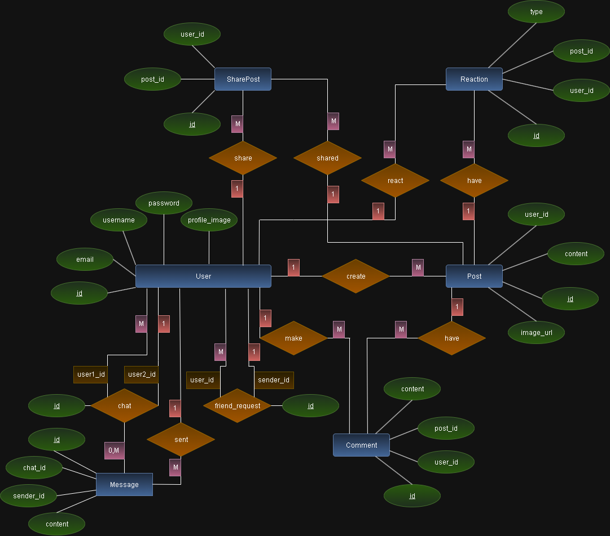

# MemeStreamApi



This is a minimal ASP.NET Core Web API project with Swagger/OpenAPI support.

## Prerequisites

- [.NET 9 SDK](https://dotnet.microsoft.com/download)
- [Visual Studio Code](https://code.visualstudio.com/) or [Visual Studio 2022+](https://visualstudio.microsoft.com/)

## Getting Started

### 1. Clone the repository

```
git clone <your-repo-url>
cd MemeStream
```

### 2. Open the project

- **VS Code:** Open the `MemeStream` folder.
- **Visual Studio:** Open `MemeStream.sln`.

### 3. Restore dependencies

```
dotnet restore
```

### 4. Run the API

```
dotnet run --project MemeStreamApi
```

### 5. Access Swagger UI

Navigate to [http://localhost:5000/swagger](http://localhost:5000/swagger) (or the port shown in the terminal) to view and test the API endpoints.

## Project Structure

- `MemeStream.sln` — Solution file for Visual Studio
- `MemeStreamApi/` — Main API project
  - `Program.cs` — Entry point and configuration
  - `appsettings.json` — App configuration
  - `Properties/launchSettings.json` — Launch profiles

## Features

- Minimal API setup
- Swagger/OpenAPI documentation
- Ready for development in VS Code or Visual Studio

## Useful Commands

- Build: `dotnet build`
- Run: `dotnet run --project MemeStreamApi`
- Test: _(add tests if available)_

## Notes

- Swagger is enabled in development mode.
- You can customize endpoints in `Program.cs`.

---

Feel free to extend this README as your project grows!
